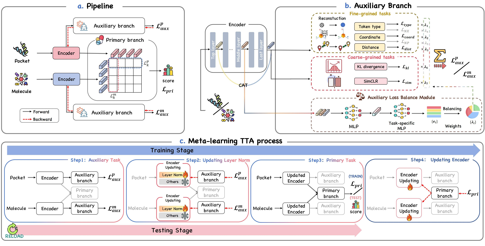

# Drug-TTA: Test-Time Adaptation for Drug Virtual Screening via Multi-task Meta-Auxiliary Learning


<!-- [[Code](xxxx - Overview)] -->



Official code for the paper "Drug-TTA: Test-Time Adaptation for Drug Virtual Screening via Multi-task Meta-Auxiliary Learning"

# Requirements

same as [DrugCLIP](https://github.com/bowen-gao/DrugCLIP.git)

### Training data

The dataset for training contains several files:

```

dick_pkt.txt: dictionary for pocket atom types

dict_mol.txt: dictionary for molecule atom types

train.lmdb: train dataset

valid.lmdb: validation dataset

```

The keys in the lmdb files and corresponding descriptions are shown below:

```

"atoms": "atom types for each atom in the ligand" 

"coordinates": "3D coordinates for each atom in the ligand generated by RDKit. Max number of conformations is 10"

"pocket_atoms": "atom types for each atom in the pocket"

"pocket_coordinates": "3D coordinates for each atom in the pocket"

"mol": "RDKit molecule object for the ligand"

"smi": "SMILES string for the ligand"

"pocket": "pdbid of the pocket",
```


The dataset is compiled from the PDBBind dataset. For evaluating on each benchmark, we exclude the benchmark from the training datasets and train Drug-TTA again. 


### Test data

#### DUD-E/AD

```
DUD-E
├── gene id
│   ├── receptor.pdb
│   ├── crystal_ligand.mol2
│   ├── actives_final.ism
│   ├── decoys_final.ism
│   ├── mols.lmdb (containing all actives and decoys)/mols_AD.lmdb
│   ├── pocket.lmdb

```

#### PCBA

```
lit_pcba
├── target name
│   ├── PDBID_protein.mol2
│   ├── PDBID_ligand.mol2
│   ├── actives.smi
│   ├── inactives.smi
│   ├── mols.lmdb (containing all actives and inactives)
│   ├── pocket.lmdb

```

#### DEKIOS2.0

```
DEKIOS2.0
├── target name
│   ├── PDBID_protein.mol2
│   ├── PDBID_ligand.mol2
│   ├── actives.smi
│   ├── inactives.smi
│   ├── mols.lmdb (containing all actives and inactives)
│   ├── pocket.lmdb

```

#### casf2016

```
casf2016
├── target name
│   ├── PDBID_protein.mol2
│   ├── PDBID_ligand.mol2
│   ├── actives.smi
│   ├── inactives.smi
│   ├── mols.lmdb (containing all actives and inactives)
│   ├── pocket.lmdb

```
### Data preprocessing

same as [DrugCLIP](https://github.com/bowen-gao/DrugCLIP.git)


## Train

bash train.sh

## Test

bash test.sh
